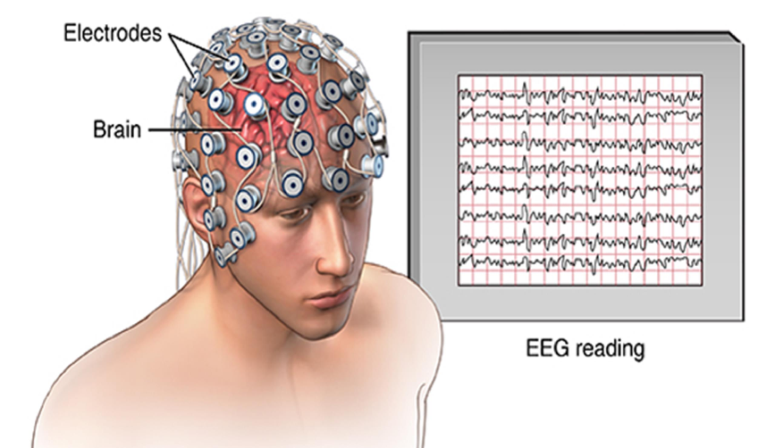
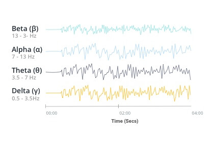
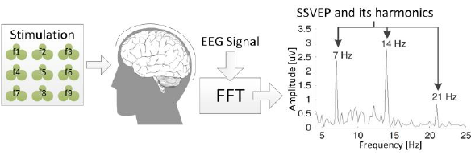
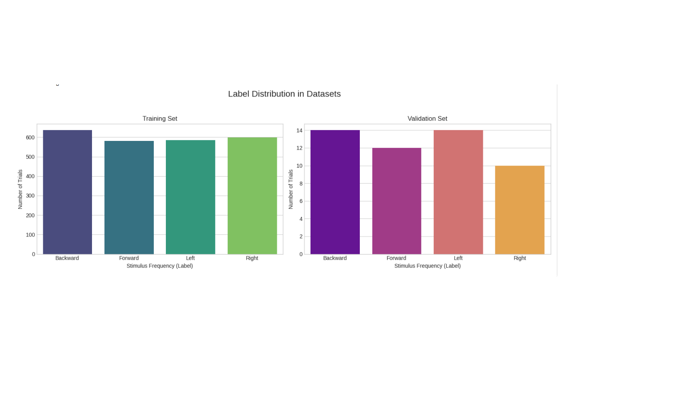

# MTC-AIC3 EEG Classification Models by MetaCode Team
## Table of Contents

- [Competition Overview](#-competition-overview)
- [ What is EEG?](#-what-is-eeg)
- [ Data Description](#-data-description)
- [EEG-Based BCI Tasks](#-eeg-based-bci-tasks)
  - [Motor Imagery (MI)](#-motor-imagery-mi)
  - [SSVEP](#-ssvep)
- [Data Preprocessing](#-data-preprocessing)
- [ Models](#-models)
- [ Results](#-results)
- [ Contributors](#-contributors)

## Competition Overview

The **AIC-3 Competition** focuses on the development of intelligent models for interpreting brain signals in the field of **non-invasive Brain-Computer Interfaces (BCIs)**. The challenge revolves around two widely studied BCI paradigms:

- **Steady-State Visual Evoked Potentials (SSVEP):** These rely on the brain's oscillatory responses to visual stimuli flickering at predefined frequencies.
- **Motor Imagery (MI):** This involves decoding neural patterns generated when a person imagines specific motor movements (hand or directional movement).

The dataset provided contains **multi-channel EEG recordings** collected during both SSVEP and MI sessions, annotated respectively with:
- Visual stimulus frequencies (for SSVEP), and  
- Motor imagery categories (for MI).

## What is EEG?

**Electroencephalography (EEG)** is a non-invasive technique used to record the electrical activity of the brain. It works by placing electrodes on the scalp, which detect voltage fluctuations resulting from the synchronous activity of large groups of neurons, especially in the cerebral cortex.
<div align="center">
  
</div>

### Key Features:

- **Multichannel**: EEG data is recorded from multiple electrodes (channels), each representing electrical signals from a specific brain region.

- **Time-series Data**: Signals are captured at high sampling rates (128–1024 Hz), making EEG highly suitable for real-time and temporal analysis.

- **High Temporal Resolution**: EEG can capture changes in brain activity within milliseconds.

- **Low Spatial Resolution**: It provides limited information about where exactly in the brain the activity is occurring.

- **Sensitive to Artifacts**: EEG signals can be affected by eye blinks, muscle movement, and electrical noise, which makes signal preprocessing crucial.


### What Does EEG Data Look Like?

EEG data is typically presented as a series of waveforms, where each waveform corresponds to the electrical activity from a specific electrode location on the scalp. These waveforms vary over time and are analyzed to detect patterns and features in the brain’s electrical activity.

<div align="center">
  
</div>

A key part of EEG analysis involves breaking down these waveforms into **frequency bands**, including:


- **Delta (0.5–4 Hz)**: Deep sleep
- **Theta (4–8 Hz)**: Light sleep, meditation
- **Alpha (8–13 Hz)**: Relaxed, calm state
- **Beta (13–30 Hz)**: Active thinking, concentration
- **Gamma (>30 Hz)**: High-level cognitive functions

These frequency bands are associated with various mental and physiological states, and extracting features from them plays a vital role in EEG-based classification tasks like MI and SSVEP.

##  Data Description

The dataset used in this competition comes from the **MTC-AIC3 BCI Competition** and contains multi-channel EEG recordings from 40 male participants (average age: 20 years).

Each participant performed tasks under two different Brain-Computer Interface paradigms: **Motor Imagery (MI)** and **Steady-State Visual Evoked Potential (SSVEP)**.

- **EEG Data**: Recordings from 8 channels.
- **EEG Channels**: 8 (FZ, C3, CZ, C4, PZ, PO7, OZ, PO8).
- **Sampling Rate**: 250 Hz
- **Subjects**: 40 participants
- **Participants**: 40 male subjects, average age 20 years.
- **Trials**:
  - MI: 9 seconds per trial → 2250 samples
  - SSVEP: 7 seconds per trial → 1750 samples
- **Trials per Session**: 10 trials for each experimental session.

### Directory Structure
The dataset is organized into two main task directories **(MI/ and SSVEP/)** within the mtc-aic3_dataset folder. 
Each task directory contains three subdirectories for data splitting:

- **train/**: Data for model training (30 subjects, 8 trial sessions per subject, 4800 total trials).
- **validation/**: Data for model validation (5 subjects, 1 trial session per subject, 100 total trials).
- **test/**: Data for model testing (5 subjects, 1 trial session per subject, 100 total trials).

Each subject's directory **(e.g., S1/, S2/)** contains session directories **(e.g., 1/)**, representing experimental sessions.

Both **MI** and **SSVEP** tasks are stored under their respective directories inside the main dataset folder...
```
mtc-aic3_dataset/
├── MI/
│   ├── train/
│   │   ├── S1/
│   │   │   └── 1/
│   │   │       └── EEGdata.csv
│   │   ├── S2/
│   │   │   └── ...
│   │   └── ...
│   ├── validation/
│   │   ├── S31/
│   │   │   └── 1/
│   │   │       └── EEGdata.csv
│   │   ├── S32/
│   │   │   └── ...
│   │   └── ...
│   └── test/
│       ├── S36/
│       │   └── 1/
│       │       └── EEGdata.csv
│       ├── S37/
│       │   └── ...
│       └── ...
├── SSVEP/
│   ├── train/
│   │   ├── S1/
│   │   │   └── 1/
│   │   │       └── EEGdata.csv
│   │   ├── S2/
│   │   │   └── ...
│   │   └── ...
│   ├── validation/
│   │   ├── S31/
│   │   │   └── 1/
│   │   │       └── EEGdata.csv
│   │   ├── S32/
│   │   │   └── ...
│   │   └── ...
│   └── test/
│       ├── S36/
│       │   └── 1/
│       │       └── EEGdata.csv
│       ├── S37/
│       │   └── ...
│       └── ...
├── train.csv
├── validation.csv
├── test.csv
└── sample_submission.csv
```

### Data File Details

#### EEGdata.csv (Inside Each Session Directory)

Each session directory contains a single `EEGdata.csv` file that holds raw EEG recordings for **all 10 trials**, concatenated sequentially.

- **Columns**:
  - `Time`
  - 8 EEG Channels: `FZ`, `C3`, `CZ`, `C4`, `PZ`, `PO7`, `OZ`, `PO8`.
  - Motion sensors: `AccX`, `AccY`, `AccZ`, `Gyro1`, `Gyro2`, `Gyro3`.
  - `Battery`, `Counter`, and `Validation` flag

- **Samples per trial**:
  - MI: `9 seconds × 250 Hz = 2250 samples`
  - SSVEP: `7 seconds × 250 Hz = 1750 samples`

#### Root-Level CSV Files

These CSV files are located at the root of the dataset and are used to structure splits:

- **`train.csv`**: Labeled training data (4800 entries).
  - Columns: `id`, `subject_id`, `task` (MI or SSVEP), `trial_session`, `trial`, `label`.
  - `id` range: **1–4800**

- **`validation.csv`**: Labeled validation data (100 entries).
  - Same columns as `train.csv`.
  - `id` range: **4801–4900**

- **`test.csv`**: Unlabeled test data (100 entries).
  - Columns: `id`, `subject_id`, `task`, `trial_session`, `trial`.
  - `id` range: **4901–5000**

- **`sample_submission.csv`**: Submission template
  - Columns: `id`, `label`.
  - `label` should be replaced with predictions for each `id` in `test.csv`.


## EEG-Based BCI Tasks
Brain-Computer Interfaces (BCIs) enable direct communication between the human brain and external devices by interpreting brain signals in real time. Among the most widely used paradigms in non-invasive BCIs are **Motor Imagery (MI)** and **Steady-State Visual Evoked Potentials (SSVEP)**.

These tasks are based on distinct cognitive processes:

### 1. Motor Imagery (MI)
It is a mental process in which a person **imagines performing a specific motor action**, such as moving the left or right hand, without any actual physical movement. Although no muscles are activated, this mental simulation generates distinct patterns of neural activity in the sensorimotor cortex (the same region involved in planning and executing real movements).
<div align="center">
  
</div>

#### Accessing MI Data

To work with the Motor Imagery (MI) trials, we first filtered only the MI-related entries from the `train.csv` and `validation.csv` files using the task column:

```
# Load index files
base_path = '/content/mtc-aic3_dataset'
train_df = pd.read_csv(f'{base_path}/train.csv')
validation_df = pd.read_csv(f'{base_path}/validation.csv')

# Filter for only MI task
train_mi = train_df[train_df['task'] == 'MI'].reset_index(drop=True)
validation_mi = validation_df[validation_df['task'] == 'MI'].reset_index(drop=True)
```
Then, we accessed the raw EEG data for each trial from its corresponding `EEGdata.csv` file.
```
# Function to load one trial's EEG data
def load_mi_trial_data(row, base_path):
    dataset = 'train' if row['id'] <= 4800 else 'validation'
    subject_id = row['subject_id']
    trial_session = row['trial_session']
    trial_num = int(row['trial'])

    eeg_file_path = os.path.join(base_path, 'MI', dataset, subject_id, str(trial_session), 'EEGdata.csv')
    eeg_data = pd.read_csv(eeg_file_path)

    samples_per_trial = 2250
    start_idx = (trial_num - 1) * samples_per_trial
    end_idx = start_idx + samples_per_trial

    trial_data = eeg_data.iloc[start_idx:end_idx]
    return trial_data
```
#### EEG Channel Visualizations (MI)

To better understand the raw EEG signals, we plotted the time series data from all 8 EEG channels for a single MI trial:

```python
channels = ['C3', 'FZ', 'CZ', 'C4', 'PZ', 'PO7', 'OZ', 'PO8']

for ch in channels:
    plt.figure(figsize=(12, 4))
    plt.plot(trial_data[ch])
    plt.title(f"EEG Signal from Channel {ch} - Subject {first_row['subject_id']} Trial {first_row['trial']} ({first_row['label']})")
    plt.xlabel("Time (samples)")
    plt.ylabel("Amplitude (μV or raw units)")
    plt.grid(True)
    plt.tight_layout()
    plt.savefig(f'images/channel_{ch}.png')  
    plt.close()
```
These visualizations help inspect the amplitude and temporal patterns across different regions of the brain during the motor imagery task.

After understanding the structure of the MI data, we extracted the **EEG signals for all trials** using the following function. It processes the full dataset and stores only the EEG channels needed for classification.
```
eeg_channels = ['FZ', 'C3', 'CZ', 'C4', 'PZ', 'PO7', 'OZ', 'PO8']

def extract_trials(df, base_path, is_test=False):
    data = []
    labels = []

    for _, row in tqdm(df.iterrows(), total=len(df)):
        # Determine dataset folder
        dataset = 'test' if row['id'] >= 4901 else ('validation' if row['id'] >= 4801 else 'train')

        subject_id = row['subject_id']
        trial_session = row['trial_session']
        trial_num = int(row['trial'])

        file_path = os.path.join(base_path, 'MI', dataset, subject_id, str(trial_session), 'EEGdata.csv')
        eeg = pd.read_csv(file_path)

        # Extract 9-second window (2250 samples) for this trial
        start = (trial_num - 1) * 2250
        end = start + 2250
        eeg_segment = eeg.iloc[start:end][eeg_channels].values  # shape: (2250, 8)

        data.append(eeg_segment)

        if not is_test:
            labels.append(0 if row['label'] == 'Left' else 1)

    return np.array(data), (None if is_test else np.array(labels))
```
We used the `extract_trials()` function to convert the raw EEG MI data into NumPy arrays for modeling.  
Each trial is represented as a matrix of shape `(2250, 8)`: corresponding to 9 seconds of EEG signals across 8 channels.

Here are the resulting dataset shapes:
```
100%|██████████| 2400/2400 [04:36<00:00, 8.67it/s]
100%|██████████| 50/50 [00:04<00:00, 11.79it/s]
100%|██████████| 50/50 [00:05<00:00, 8.82it/s]
Train shape: (2400, 2250, 8), Labels: (2400,)
Val shape: (50, 2250, 8), Labels: (50,)
Test shape: (50, 2250, 8)
```

### 2. Steady-State Visual Evoked Potential (SSVEP)
It is a type of brain response that occurs when a person focuses their visual attention on a flickering visual stimulus (a light or pattern flashing at a constant frequency).

The brain produces electrical activity at the same frequency (or harmonics of it), which can be recorded using EEG signals.
Each stimulus flickers at a unique frequency (e.g., 7 Hz, 10 Hz, etc.), allowing classification based on the dominant frequency in the EEG.

<div align="center">
  
</div>

#### Accessing SSVEP Data

To work with the SSVEP trials, we first filtered only the **SSVEP-related entries** from the `train.csv` and `validation.csv` files using the task column:

```
train_ssvep_df = train_df[train_df['task'] == "SSVEP"].reset_index(drop=True)
    val_ssvep_df = validation_df[validation_df['task'] == "SSVEP"].reset_index(drop=True)
    test_ssvep_df = test_df[test_df['task'] == "SSVEP"].reset_index(drop=True)
    print(f"Loaded {len(train_ssvep_df)} training, {len(val_ssvep_df)} validation, and {len(test_ssvep_df)} test trials for SSVEP task.")
```
Then loading the EEG data as before.
Here are the resulting dataset shapes:

```
Processing Train: 100%   2400/2400 [03:51<00:00, 11.88it/s]
Finished processing Train. Extracted features for 2400 trials.
Processing Validation: 100%   50/50 [00:05<00:00,  9.10it/s]
Finished processing Validation. Extracted features for 50 trials.
Processing Test: 100%   50/50 [00:04<00:00, 12.71it/s]
Finished processing Test. Extracted features for 50 trials.
```

#### Initial Data Exploration & Visualizations

Before any processing, we visualized the distribution of labels in the training and validation sets to ensure they are balanced. Then, plotting the raw EEG signals from a single trial to understand what our input data looks like.

Here are the plots:
<div align="center">
  
</div>
There is a difference in labels distribution in validation data specially in `Right` and `Forward` labels.


## Data Preprocessing

Since EEG data is fundamentally different from typical structured datasets, traditional preprocessing techniques (like removing nulls or standard tabular scaling) are not sufficient. Instead, EEG signals require **signal-specific preprocessing** techniques to handle their unique characteristics such as noise, artifacts, and high temporal resolution.

In this project, we designed two separate preprocessing pipelines tailored to each task:

- **Motor Imagery (MI)**: Focused on isolating motor-related patterns from brain activity.
- **Steady-State Visual Evoked Potentials (SSVEP)**: Focused on extracting frequency components associated with visual stimulus response.

Each task required unique transformations to optimize the signal quality for effective classification.
### 1. Motor Imagery 

 MI EEG data was preprocessed through several signal-specific steps to enhance relevant patterns and reduce noise and subject variability. 
 
Here is the Preprocessing pipeline:
#### 1.1 **Trial-wise Normalization**

EEG signals vary significantly in magnitude across trials. This normalization ensures **each trial has zero mean and unit variance**, making signals more comparable so before any filtering, **each trial is normalized independently** to center the signal and reduce amplitude variation.
```
def normalize_trials(X):
    mean = X.mean(axis=1, keepdims=True)
    std = X.std(axis=1, keepdims=True)
    return (X - mean) / std

X_train = normalize_trials(X_train)
X_val = normalize_trials(X_val)
X_test = normalize_trials(X_test)
```
#### 1.2 **Bandpass Filtering (8–30 Hz)**

It is a signal processing technique that **allows only a specific range of frequencies to pass through** while removing all others ((frequencies below and above the chosen range).

For MI tasks, the most relevant frequencies are:

- **Mu rhythms (8–13 Hz)**

- **Beta rhythms (13–30 Hz)**
  
So, we filter our EEG data to only keep signals between **8 Hz and 30 Hz**, removing irrelevant lower (eye blinks, movement) and higher frequencies (noise or muscle artifacts) as follows:

```
def bandpass_filter(data, low=8, high=30, fs=250, order=4):
    nyquist = 0.5 * fs
    low /= nyquist
    high /= nyquist
    b, a = butter(order, [low, high], btype='band')
    return filtfilt(b, a, data, axis=0)

X_train = np.array([bandpass_filter(trial) for trial in X_train])
X_val = np.array([bandpass_filter(trial) for trial in X_val])
X_test = np.array([bandpass_filter(trial) for trial in X_test])
```
#### 1.3 **Subject-wise Normalization**

EEG signals vary significantly between individuals due to differences in scalp conductivity, brain anatomy, and even electrode placement. If we normalize all trials globally, the model may overfit to subject-specific signal strengths or biases.

So, we apply subject-wise normalization which normalize EEG data individually for each subject as it reduces this bias by:

- Making each subject's data comparable in scale.

- Helping the model focus on patterns related to the MI task not the person.

Here is the function:
```
def subjectwise_normalize(X, df):
    subject_map = group_trials_by_subject(X, df)
    X_norm = np.empty_like(X)

    for subject_id, indices in subject_map.items():
        subject_data = X[indices]  # shape: (n_trials, n_time, n_channels)

        # Flatten over trials and time to get overall stats
        all_data = subject_data.reshape(-1, X.shape[2])  # (n_trials * time, n_channels)

        mean = all_data.mean(axis=0)
        std = all_data.std(axis=0)

        # Normalize each trial
        X_norm[indices] = (subject_data - mean) / std

    return X_norm
```
It groups trials by `subject ID` and then for each subject:

- Flatten all their EEG data across time and trials.

- Compute mean and standard deviation per EEG channel.

- Normalize each trial.
  
- Return normalized data, with consistent channel distribution per subject.

#### 1.4 Common Spatial Pattern (CSP) Filtering

It is a powerful spatial filtering technique used in EEG signal processing as it helps to enhance the discriminability between two mental states **(imagining left hand vs. right hand movement)** by projecting the EEG data into a new space that maximizes variance for one class while minimizing it for the other.

Since EEG signals are recorded from multiple electrodes (channels) placed across the scalp and not all channels are equally informative for every task so, CSP finds optimal linear combinations of these channels (spatial filters) that **highlight patterns most relevant to distinguishing the two classes**.

```
X_train_csp_input = X_train.transpose(0, 2, 1)  # (n_trials, n_channels, n_times)
X_val_csp_input = X_val.transpose(0, 2, 1)

csp = CSP(n_components=4, reg=None, log=True, norm_trace=False)
X_train_csp = csp.fit_transform(X_train_csp_input, y_train)
X_val_csp = csp.transform(X_val_csp_input)
```
We specifiy `n_components=4` (CSP features per trial) which are the spatial filters that best discriminate between your two MI classes (left vs. right hand) then applying a log-transform to the filtered signal power. This often improves classification by **reducing skewed feature distributions**.

#### 1.5 Power Spectral Density (PSD) Features

PSD describes how the power (energy) of a signal is distributed across different frequency components and how much power exists in brainwave frequencies like alpha, beta, theta, etc.

We extracted PSD features using Welch's method across standard EEG bands: **delta, theta, alpha, beta, gamma** as they reflect how signal power is distributed across frequencies that are crucial for capturing rhythmic brain activity.

```
from scipy.signal import welch

def compute_psd(trial, fs=250, bands=[(0.5,4), (4,8), (8,13), (13,30), (30,50)]):
    features = []
    for ch in range(trial.shape[1]):
        f, Pxx = welch(trial[:, ch], fs=fs, nperseg=256)
        for band in bands:
            fmin, fmax = band
            band_power = np.trapz(Pxx[(f >= fmin) & (f <= fmax)], f[(f >= fmin) & (f <= fmax)])
            features.append(band_power)
    return features

def extract_psd_features(X):
    return np.array([compute_psd(trial) for trial in X])

X_train_psd = extract_psd_features(X_train)
X_val_psd = extract_psd_features(X_val)
```

#### 1.6 Feature Fusion: CSP + PSD

Finally, we concatenated CSP and PSD features into a single feature set for classification.

```
X_train_csp_psd = np.hstack([X_train_csp, X_train_psd])
X_val_csp_psd = np.hstack([X_val_csp, X_val_psd])
```
By concatenating both we:

- leverage spatial + spectral features.

- give the model richer information to learn especially when either CSP or PSD alone isn’t enough.

### 2. SSVEP 

In SSVEP, the brain produces electrical activity at the same frequency as the visual stimulus (e.g., 7 Hz, 8 Hz, 10 Hz, 13 Hz).

To detect this frequency-specific response, we must:

- Apply bandpass filters to isolate relevant frequency ranges.

- Use Power Spectral Density (PSD) to extract frequency-domain features.
Here is the Preprocessing pipeline:
#### 2.1 **Bandpass Filtering (Butterworth Filter)**

To enhance relevant frequency information and suppress unwanted noise, we apply a 4th-order Butterworth band-pass filter. This filter is designed to retain only frequencies between 4 Hz and 42 Hz, where the brain's response to visual stimuli (SSVEP) is typically found.
```
def apply_butterworth_filter(data, fs=250):
    lowcut, highcut, order = 4.0, 42.0, 4
    # Nyquist frequency is half the sampling rate.
    nyq = 0.5 * fs
    # Normalize the cutoff frequencies.
    low, high = lowcut / nyq, highcut / nyq
    # Get the filter coefficients (numerator 'b' and denominator 'a').
    b, a = butter(order, [low, high], btype='band')
    # Apply the filter along the columns (axis=0).
    # A check is included to handle constant-value signals, which would cause filtfilt to fail.
    filtered_data = np.apply_along_axis(lambda x: filtfilt(b, a, x) if not np.all(x == x[0]) else x, 0, data)
    return filtered_data
```

#### 2.2 Power Spectral Density Feature Extraction for SSVEP

To effectively classify SSVEP signals, we need to extract features that represent how much power is concentrated around specific frequencies corresponding to visual stimulus. These features are derived from the EEG signal's Power Spectral Density (PSD) using Welch’s method.

```
def extract_psd_features(data, fs=250):
    all_features = []
    # Define the length of each segment for Welch's method (4 seconds of data).
    nperseg = fs * 4
    # Iterate through each EEG channel (columns of the data).
    for i in range(data.shape[1]):
        channel_data = data[:, i]
        freqs, psd = welch(channel_data, fs=fs, nperseg=nperseg, nfft=nperseg*2)
        # Iterate through each target frequency (7 Hz, 8 Hz, ...).
        for f in TARGET_FREQS:
            for h in range(1, 4):
                harmonic_freq = h * f
                target_idx = np.argmin(np.abs(freqs - harmonic_freq))
                # Define the noise band as frequencies within +/- 3 Hz of the harmonic
                noise_indices = np.where((freqs >= harmonic_freq - 3) & (freqs <= harmonic_freq + 3) & (np.abs(freqs - harmonic_freq) > 0.25))[0]
                signal_power = psd[target_idx]
                noise_power = np.mean(psd[noise_indices]) if len(noise_indices) > 0 else 1e-12 # Add a small value to avoid division by zero.
                snr = signal_power / noise_power
                all_features.append(signal_power)
                all_features.append(snr)
    return np.array(all_features)
```
For each trial, we computed the signal power and SNR for the 4 target frequencies (7, 8, 10, 13 Hz) and their first three harmonics across each of the 4 occipital-parietal channels (PO7, PZ, OZ, PO8). This provided us with a rich feature set that captures frequency-domain information essential for SSVEP classification.

Then We plotted both the time-domain and frequency-domain representations of the EEG signal from the OZ channel, a region highly responsive to visual stimuli. The raw and filtered signals demonstrate the effect of bandpass filtering, while PSD reveals clear frequency peaks at stimulation frequencies (7–13 Hz), confirming the presence of SSVEP responses crucial for classification.

#### 2.3 Scaling and Encoding

Before feeding the features into a machine learning model, it is important to normalize the input data and encode categorical labels properly to improve model performance and stability.

```
scaler = MinMaxScaler()
X_train_scaled = scaler.fit_transform(X_train)
X_val_scaled = scaler.transform(X_val)
X_test_scaled = scaler.transform(X_test)
 from sklearn.preprocessing import LabelEncoder

label_encoder = LabelEncoder()
y_train_encoded = label_encoder.fit_transform(y_train)
y_val_encoded = label_encoder.transform(y_val)
```

#### 2.4 Feature Selection

After feature extraction and scaling, we may end up with a high-dimensional feature space. Not all features contribute equally to model performance. To reduce overfitting and enhance generalization, we apply feature selection to retain only the most informative features.

We use a **Random Forest classifier** to estimate feature importance. Then, **SelectFromModel** selects features whose importance is above a threshold—here `the median importance score`.

```
sel_clf = RandomForestClassifier(n_estimators=100, random_state=42, n_jobs=-1)
sel_clf.fit(X_train_scaled, y_train_encoded)

#Select features with importance above the median
selector = SelectFromModel(sel_clf, prefit=True, threshold='median')

X_train_selected = selector.transform(X_train_scaled)
X_val_selected = selector.transform(X_val_scaled)
X_test_selected = selector.transform(X_test_scaled)
```
- **Initial Features**: `96`

- **Selected Features**: `48`

This helped improve model performance and **reduce overfitting by eliminating less relevant features**.

## Models

### 1. MI Classification  Model

We experimented with several baseline classifiers for both Motor Imagery (MI) and SSVEP tasks to understand which models perform best on EEG data.

These included:
- Random Forest
- CatBoost
- Support Vector Machine 
- Logistic Regression

In order to achieve the highest accuracy, we choose **CatBoostClassifier**, a gradient boosting algorithm that is:

- Fast and accurate on tabular data.

- Less prone to overfitting with small datasets.

#### 1.1 Model Setup and Training:
```
cat_clf = CatBoostClassifier(
    iterations=85,
    learning_rate=0.05,
    depth=5,
    l2_leaf_reg=3.0,
    loss_function='Logloss',
    eval_metric='Accuracy',
    random_seed=42,
    verbose=False,
    class_weights=[1.1, 0.9]  # Handling class imbalance
)
```
The reason of why we adjust `class_weights` as we observe that there is a slightly difference in the label distribution of validation data:
- 25 observations have "Left" label.
- 20 observations have "Right" label.

Then we trained the model on the fused CSP + PSD features using the training data and applying predictions on validation data:
```
cat_clf.fit(X_train_csp_psd, y_train)

# predictions on validation data
y_train_pred = cat_clf.predict(X_train_csp_psd)
y_val_pred = cat_clf.predict(X_val_csp_psd)
```

#### 1.2 Model Performance:

The model was evaluated on both the training and validation sets:

- **Training Accuracy:** `0.6733`  
- **Validation Accuracy:** `0.6400`

#### 1.3 Model Summary

| Class / Metric   | Precision | Recall | F1-Score |
|------------------|-----------|--------|----------|
| **Left**         | 0.68      | 0.68   | 0.68     |
| **Right**        | 0.59      | 0.59   | 0.59     |
| **Macro Avg**    | 0.63      | 0.63   | 0.63     |
| **Weighted Avg** | 0.64      | 0.64   | 0.64     |
| **Accuracy**     | –         | –      | **0.6400** |

### 2. SSVEP Classification Model

After training the Random Forest classifier and several other baseline models, we observed the need to improve generalization and reduce potential overfitting. 

To address this, we employed aggressive regularization using **RandomizedSearchCV**.

#### 1.1 Model Setup and Training:

W choose the best model which is **Random Forest Classifier**

First, we define the parameters:
```
param_dist = {
    'n_estimators': [50, 100, 150],
    'max_depth': [4, 5, 6, 7],
    'min_samples_leaf': [6, 8, 10, 12],
    'max_features': ['sqrt', 0.5],
    'class_weight': ['balanced']
}
```
After that we apply **Stratified Cross-Validation Strategy** which ensures each fold contains approximately the same class distribution as the full dataset.

Then run **RandomizedSearchCV**
```
random_search = RandomizedSearchCV(
    estimator=RandomForestClassifier(random_state=42, n_jobs=-1),
    param_distributions=param_dist,
    n_iter=25,
    cv=cv_strategy,
    scoring='accuracy',
    verbose=1,
    random_state=42,
    n_jobs=-1
)
```
Fitting the search on the data:
```
random_search.fit(X_train_selected, y_train_encoded)
```
And retrieve the best model
```
best_rf = random_search.best_estimator_
``` 
The model with the best validation performance **(highest accuracy)** is stored in `best_rf` and used for final predictions.


