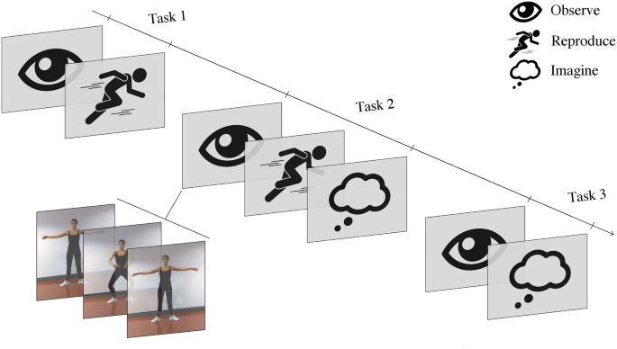

# MTC-AIC3 EEG Classification Models by MetaCode Team
## Table of Contents

- [Competition Overview](#-competition-overview)
- [ What is EEG?](#-what-is-eeg)
- [ Data Description](#-data-description)
- [EEG-Based BCI Tasks](#-eeg-based-bci-tasks)
  - [Motor Imagery (MI)](#-motor-imagery-mi)
  - [SSVEP](#-ssvep)
- [Data Preprocessing](#-data-preprocessing)
- [ Models](#-models)
- [ Results](#-results)
- [ Contributors](#-contributors)

## Competition Overview

The **AIC-3 Competition** focuses on the development of intelligent models for interpreting brain signals in the field of **non-invasive Brain-Computer Interfaces (BCIs)**. The challenge revolves around two widely studied BCI paradigms:

- **Steady-State Visual Evoked Potentials (SSVEP):** These rely on the brain's oscillatory responses to visual stimuli flickering at predefined frequencies.
- **Motor Imagery (MI):** This involves decoding neural patterns generated when a person imagines specific motor movements (hand or directional movement).

The dataset provided contains **multi-channel EEG recordings** collected during both SSVEP and MI sessions, annotated respectively with:
- Visual stimulus frequencies (for SSVEP), and  
- Motor imagery categories (for MI).

## What is EEG?

**Electroencephalography (EEG)** is a non-invasive technique used to record the electrical activity of the brain. It works by placing electrodes on the scalp, which detect voltage fluctuations resulting from the synchronous activity of large groups of neurons, especially in the cerebral cortex.
<div align="center">
  
</div>

### Key Features:

- **Multichannel**: EEG data is recorded from multiple electrodes (channels), each representing electrical signals from a specific brain region.

- **Time-series Data**: Signals are captured at high sampling rates (128–1024 Hz), making EEG highly suitable for real-time and temporal analysis.

- **High Temporal Resolution**: EEG can capture changes in brain activity within milliseconds.

- **Low Spatial Resolution**: It provides limited information about where exactly in the brain the activity is occurring.

- **Sensitive to Artifacts**: EEG signals can be affected by eye blinks, muscle movement, and electrical noise, which makes signal preprocessing crucial.


### What Does EEG Data Look Like?

EEG data is typically presented as a series of waveforms, where each waveform corresponds to the electrical activity from a specific electrode location on the scalp. These waveforms vary over time and are analyzed to detect patterns and features in the brain’s electrical activity.

<div align="center">
  
</div>

A key part of EEG analysis involves breaking down these waveforms into **frequency bands**, including:


- **Delta (0.5–4 Hz)**: Deep sleep
- **Theta (4–8 Hz)**: Light sleep, meditation
- **Alpha (8–13 Hz)**: Relaxed, calm state
- **Beta (13–30 Hz)**: Active thinking, concentration
- **Gamma (>30 Hz)**: High-level cognitive functions

These frequency bands are associated with various mental and physiological states, and extracting features from them plays a vital role in EEG-based classification tasks like MI and SSVEP.

##  Data Description

The dataset used in this competition comes from the **MTC-AIC3 BCI Competition** and contains multi-channel EEG recordings from 40 male participants (average age: 20 years).

Each participant performed tasks under two different Brain-Computer Interface paradigms: **Motor Imagery (MI)** and **Steady-State Visual Evoked Potential (SSVEP)**.

- **EEG Data**: Recordings from 8 channels.
- **EEG Channels**: 8 (FZ, C3, CZ, C4, PZ, PO7, OZ, PO8).
- **Sampling Rate**: 250 Hz
- **Subjects**: 40 participants
- **Participants**: 40 male subjects, average age 20 years.
- **Trials**:
  - MI: 9 seconds per trial → 2250 samples
  - SSVEP: 7 seconds per trial → 1750 samples
- **Trials per Session**: 10 trials for each experimental session.

### Directory Structure
The dataset is organized into two main task directories **(MI/ and SSVEP/)** within the mtc-aic3_dataset folder. 
Each task directory contains three subdirectories for data splitting:

- **train/**: Data for model training (30 subjects, 8 trial sessions per subject, 4800 total trials).
- **validation/**: Data for model validation (5 subjects, 1 trial session per subject, 100 total trials).
- **test/**: Data for model testing (5 subjects, 1 trial session per subject, 100 total trials).

Each subject's directory **(e.g., S1/, S2/)** contains session directories **(e.g., 1/)**, representing experimental sessions.

Both **MI** and **SSVEP** tasks are stored under their respective directories inside the main dataset folder...
```
mtc-aic3_dataset/
├── MI/
│   ├── train/
│   │   ├── S1/
│   │   │   └── 1/
│   │   │       └── EEGdata.csv
│   │   ├── S2/
│   │   │   └── ...
│   │   └── ...
│   ├── validation/
│   │   ├── S31/
│   │   │   └── 1/
│   │   │       └── EEGdata.csv
│   │   ├── S32/
│   │   │   └── ...
│   │   └── ...
│   └── test/
│       ├── S36/
│       │   └── 1/
│       │       └── EEGdata.csv
│       ├── S37/
│       │   └── ...
│       └── ...
├── SSVEP/
│   ├── train/
│   │   ├── S1/
│   │   │   └── 1/
│   │   │       └── EEGdata.csv
│   │   ├── S2/
│   │   │   └── ...
│   │   └── ...
│   ├── validation/
│   │   ├── S31/
│   │   │   └── 1/
│   │   │       └── EEGdata.csv
│   │   ├── S32/
│   │   │   └── ...
│   │   └── ...
│   └── test/
│       ├── S36/
│       │   └── 1/
│       │       └── EEGdata.csv
│       ├── S37/
│       │   └── ...
│       └── ...
├── train.csv
├── validation.csv
├── test.csv
└── sample_submission.csv
```

### Data File Details

#### EEGdata.csv (Inside Each Session Directory)

Each session directory contains a single `EEGdata.csv` file that holds raw EEG recordings for **all 10 trials**, concatenated sequentially.

- **Columns**:
  - `Time`
  - 8 EEG Channels: `FZ`, `C3`, `CZ`, `C4`, `PZ`, `PO7`, `OZ`, `PO8`.
  - Motion sensors: `AccX`, `AccY`, `AccZ`, `Gyro1`, `Gyro2`, `Gyro3`.
  - `Battery`, `Counter`, and `Validation` flag

- **Samples per trial**:
  - MI: `9 seconds × 250 Hz = 2250 samples`
  - SSVEP: `7 seconds × 250 Hz = 1750 samples`

#### Root-Level CSV Files

These CSV files are located at the root of the dataset and are used to structure splits:

- **`train.csv`**: Labeled training data (4800 entries).
  - Columns: `id`, `subject_id`, `task` (MI or SSVEP), `trial_session`, `trial`, `label`.
  - `id` range: **1–4800**

- **`validation.csv`**: Labeled validation data (100 entries).
  - Same columns as `train.csv`.
  - `id` range: **4801–4900**

- **`test.csv`**: Unlabeled test data (100 entries).
  - Columns: `id`, `subject_id`, `task`, `trial_session`, `trial`.
  - `id` range: **4901–5000**

- **`sample_submission.csv`**: Submission template
  - Columns: `id`, `label`.
  - `label` should be replaced with predictions for each `id` in `test.csv`.


## EEG-Based BCI Tasks
Brain-Computer Interfaces (BCIs) enable direct communication between the human brain and external devices by interpreting brain signals in real time. Among the most widely used paradigms in non-invasive BCIs are **Motor Imagery (MI)** and **Steady-State Visual Evoked Potentials (SSVEP)**.

These tasks are based on distinct cognitive processes:

### 1. Motor Imagery (MI)
It is a mental process in which a person **imagines performing a specific motor action**, such as moving the left or right hand, without any actual physical movement. Although no muscles are activated, this mental simulation generates distinct patterns of neural activity in the sensorimotor cortex (the same region involved in planning and executing real movements).
<div align="center">
  
</div>

#### Accessing MI Data

To work with the Motor Imagery (MI) trials, we first filtered only the MI-related entries from the `train.csv` and `validation.csv` files using the task column:

```
# Load index files
base_path = '/content/mtc-aic3_dataset'
train_df = pd.read_csv(f'{base_path}/train.csv')
validation_df = pd.read_csv(f'{base_path}/validation.csv')

# Filter for only MI task
train_mi = train_df[train_df['task'] == 'MI'].reset_index(drop=True)
validation_mi = validation_df[validation_df['task'] == 'MI'].reset_index(drop=True)
```
Then, we accessed the raw EEG data for each trial from its corresponding `EEGdata.csv` file.
```
# Function to load one trial's EEG data
def load_mi_trial_data(row, base_path):
    dataset = 'train' if row['id'] <= 4800 else 'validation'
    subject_id = row['subject_id']
    trial_session = row['trial_session']
    trial_num = int(row['trial'])

    eeg_file_path = os.path.join(base_path, 'MI', dataset, subject_id, str(trial_session), 'EEGdata.csv')
    eeg_data = pd.read_csv(eeg_file_path)

    samples_per_trial = 2250
    start_idx = (trial_num - 1) * samples_per_trial
    end_idx = start_idx + samples_per_trial

    trial_data = eeg_data.iloc[start_idx:end_idx]
    return trial_data
```
#### EEG Channel Visualizations (MI)

To better understand the raw EEG signals, we plotted the time series data from all 8 EEG channels for a single MI trial:

```python
channels = ['C3', 'FZ', 'CZ', 'C4', 'PZ', 'PO7', 'OZ', 'PO8']

for ch in channels:
    plt.figure(figsize=(12, 4))
    plt.plot(trial_data[ch])
    plt.title(f"EEG Signal from Channel {ch} - Subject {first_row['subject_id']} Trial {first_row['trial']} ({first_row['label']})")
    plt.xlabel("Time (samples)")
    plt.ylabel("Amplitude (μV or raw units)")
    plt.grid(True)
    plt.tight_layout()
    plt.savefig(f'images/channel_{ch}.png')  
    plt.close()
```
These visualizations help inspect the amplitude and temporal patterns across different regions of the brain during the motor imagery task.

After understanding the structure of the MI data, we extracted the **EEG signals for all trials** using the following function. It processes the full dataset and stores only the EEG channels needed for classification.
```
eeg_channels = ['FZ', 'C3', 'CZ', 'C4', 'PZ', 'PO7', 'OZ', 'PO8']

def extract_trials(df, base_path, is_test=False):
    data = []
    labels = []

    for _, row in tqdm(df.iterrows(), total=len(df)):
        # Determine dataset folder
        dataset = 'test' if row['id'] >= 4901 else ('validation' if row['id'] >= 4801 else 'train')

        subject_id = row['subject_id']
        trial_session = row['trial_session']
        trial_num = int(row['trial'])

        file_path = os.path.join(base_path, 'MI', dataset, subject_id, str(trial_session), 'EEGdata.csv')
        eeg = pd.read_csv(file_path)

        # Extract 9-second window (2250 samples) for this trial
        start = (trial_num - 1) * 2250
        end = start + 2250
        eeg_segment = eeg.iloc[start:end][eeg_channels].values  # shape: (2250, 8)

        data.append(eeg_segment)

        if not is_test:
            labels.append(0 if row['label'] == 'Left' else 1)

    return np.array(data), (None if is_test else np.array(labels))
```
We used the `extract_trials()` function to convert the raw EEG MI data into NumPy arrays for modeling.  
Each trial is represented as a matrix of shape `(2250, 8)`: corresponding to 9 seconds of EEG signals across 8 channels.

Here are the resulting dataset shapes:
```
100%|██████████| 2400/2400 [04:36<00:00, 8.67it/s]
100%|██████████| 50/50 [00:04<00:00, 11.79it/s]
100%|██████████| 50/50 [00:05<00:00, 8.82it/s]
Train shape: (2400, 2250, 8), Labels: (2400,)
Val shape: (50, 2250, 8), Labels: (50,)
Test shape: (50, 2250, 8)
```
## Data Preprocessing

Since EEG data is fundamentally different from typical structured datasets, traditional preprocessing techniques (like removing nulls or standard tabular scaling) are not sufficient. Instead, EEG signals require **signal-specific preprocessing** techniques to handle their unique characteristics such as noise, artifacts, and high temporal resolution.

In this project, we designed two separate preprocessing pipelines tailored to each task:

- **Motor Imagery (MI)**: Focused on isolating motor-related patterns from brain activity.
- **Steady-State Visual Evoked Potentials (SSVEP)**: Focused on extracting frequency components associated with visual stimulus response.

Each task required unique transformations to optimize the signal quality for effective classification.
### 1. Motor Imagery 

 MI EEG data was preprocessed through several signal-specific steps to enhance relevant patterns and reduce noise and subject variability. 
 
Here is the Preprocessing pipeline:
#### 1.1 **Trial-wise Normalization**

EEG signals vary significantly in magnitude across trials. This normalization ensures **each trial has zero mean and unit variance**, making signals more comparable so before any filtering, **each trial is normalized independently** to center the signal and reduce amplitude variation.
#### 1.2 **Bandpass Filtering (8–30 Hz)**


